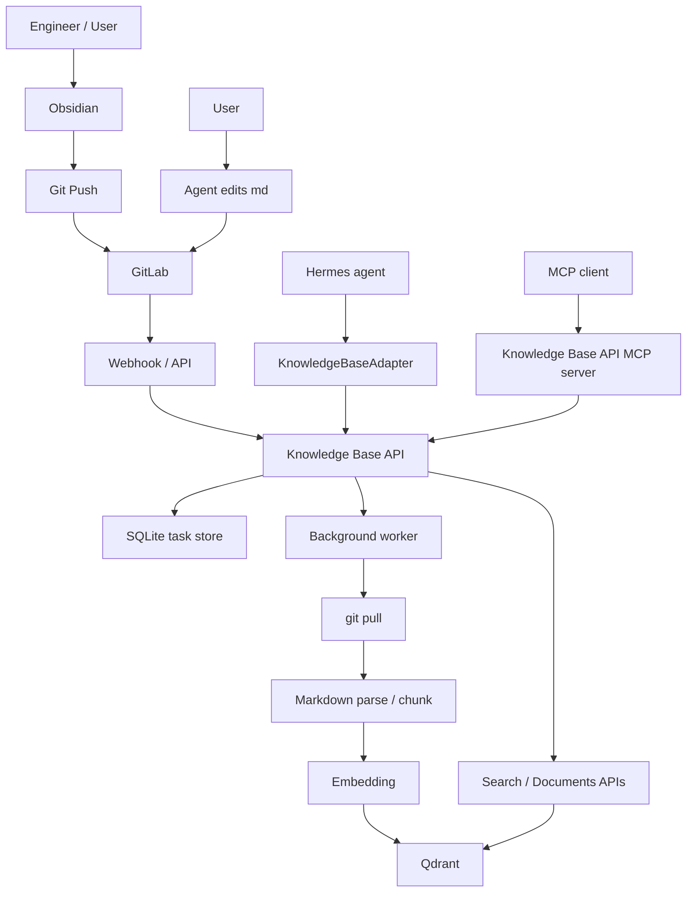

# Knowledge Base API Project Overview

This document is the consolidated entry point for the project documentation.
It summarizes the architecture, runtime flow, agent integration, deployment, monitoring, and the purpose of each supporting markdown file.

## 1. Project Goal

Build a department knowledge system where:

- GitLab is the single source of truth.
- Markdown notes from Obsidian are the primary content format.
- Attachments may live in the repository but are not indexed.
- Merge-to-`master` is the only formal publication trigger.
- Knowledge Base API handles sync, indexing, query, task tracking, and MCP access.
- Hermes agents access the knowledge base through a stable API or MCP tool layer.

## 2. Core Architecture

## 3. Runtime Flow

### 3.1 Ingestion

1. Engineer edits notes in Obsidian.
2. Changes are pushed to GitLab.
3. Merge to `master` triggers GitLab webhook.
4. Knowledge Base API creates a sync task.
5. Worker pulls latest Git state, parses changed Markdown, chunks text, embeds, and writes to Qdrant.

### 3.2 Query

1. Hermes agent or external tool calls Knowledge Base API.
2. Search and document endpoints query Qdrant.
3. Results include file path, chunk id, heading path, position, text, score, and metadata.

### 3.3 MCP

1. Hermes agent launches the MCP server or talks to it through a client.
2. MCP exposes standardized tools.
3. Tools call the same Knowledge Base API backend through the adapter layer.

## 4. Components

### 4.1 Knowledge Base API

Main service responsible for:

- GitLab webhook ingestion
- task creation and retry
- git synchronization
- Markdown chunking and embedding
- Qdrant write/query access
- health and readiness checks
- JSON logging for Loki

### 4.2 Qdrant

Stores indexed chunks and payload metadata. The demo embedding currently uses 8-dimensional vectors.

### 4.3 SQLite

Stores sync tasks, key-value state, and index records.

### 4.4 Hermes Agent

Uses `KnowledgeBaseAdapter` or the MCP tool layer to:

- search knowledge
- read documents
- inspect task status
- request updates or reindex

### 4.5 MCP

Provides a standard tool interface for agent frameworks. It is a thin wrapper around the Knowledge Base API.

## 5. API Surface

### Write / Sync

- `POST /webhooks/gitlab`
- `POST /api/v1/sync-tasks`
- `GET /api/v1/sync-tasks`
- `GET /api/v1/sync-tasks/{task_id}`
- `POST /api/v1/sync-tasks/{task_id}/retry`
- `POST /api/v1/reindex`

### Read / Query

- `GET /api/v1/search?q=...`
- `GET /api/v1/documents?path=...`

### Ops

- `GET /health`
- `GET /ready`
- `GET /`
- `GET /ui`

## 6. Environment Variables

Primary settings:

- `KB_API_HOST`
- `KB_API_PORT`
- `KB_API_HOST_PORT`
- `KB_API_DB_PATH`
- `KB_API_REPO_PATH`
- `KB_API_MAIN_BRANCH`
- `KB_API_WEBHOOK_TOKEN`
- `KB_API_LOG_LEVEL`
- `KB_API_LOG_FORMAT`
- `KB_API_ENV`
- `QDRANT_URL`
- `QDRANT_API_KEY`
- `QDRANT_COLLECTION`

MCP settings:

- `KB_API_BASE_URL`
- `KB_API_HTTP_TIMEOUT`
- `KB_API_MCP_LOG_LEVEL`

## 7. Deployment Paths

- Local Python run
- Docker run
- Docker Compose
- systemd or other process managers for MCP / API if needed

## 8. Logging and Monitoring

- JSON logs are enabled for Loki-friendly output.
- Docker Compose labels are included for log routing.
- Grafana Alloy and Promtail examples live under `deploy/`.
- Monitoring notes are consolidated in `monitoring.md`.

## 9. Documentation Map

### Core docs

- [README.md](./README.md)
- [architecture_overview.md](./architecture_overview.md)
- [knowledge_base_system_spec.md](./knowledge_base_system_spec.md)
- [development_api_webhook_spec.md](./development_api_webhook_spec.md)
- [PRD_v2_knowledge_base.md](./PRD_v2_knowledge_base.md)

### Agent and MCP docs

- [agent_query_contract_v1.md](./agent_query_contract_v1.md)
- [examples/mcp_client_example.py](./examples/mcp_client_example.py)
- [examples/hermes_mcp_settings_full.yaml](./examples/hermes_mcp_settings_full.yaml)
- [examples/hermes_mcp_settings_local.yaml](./examples/hermes_mcp_settings_local.yaml)
- [examples/hermes_mcp_settings_server.yaml](./examples/hermes_mcp_settings_server.yaml)

### Operations docs

- [monitoring.md](./monitoring.md)
- [deploy/promtail-config.yml](./deploy/promtail-config.yml)
- [deploy/alloy-config.alloy](./deploy/alloy-config.alloy)

### Planning docs

- [work_breakdown.md](./work_breakdown.md)
- [PRD_knowledge_base.md](./PRD_knowledge_base.md)

## 10. Recommended Reading Order

1. Read this overview first.
2. Read `README.md` for quickstart and endpoints.
3. Read `architecture_overview.md` for system flow.
4. Read `knowledge_base_system_spec.md` for formal requirements.
5. Read `agent_query_contract_v1.md` and MCP docs for agent integration.
6. Read `monitoring.md` for Loki / Alloy / Promtail setup.
