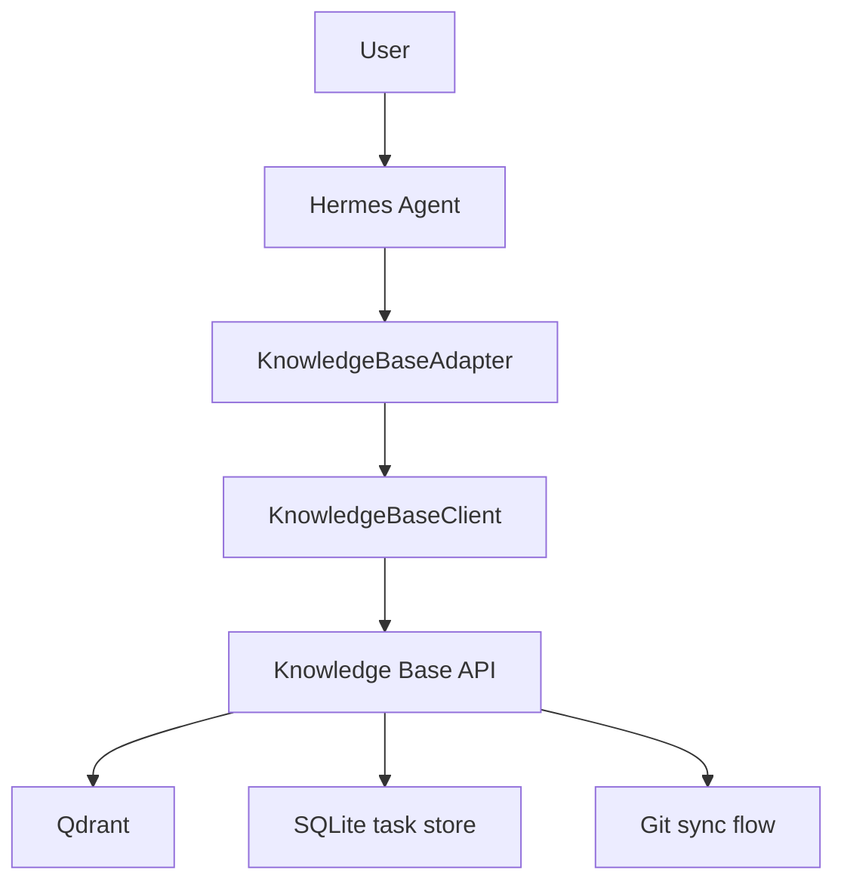

# Knowledge Base API

Project overview: [PROJECT_OVERVIEW.md](./PROJECT_OVERVIEW.md)

This repo contains a minimal, dependency-free Python implementation of the knowledge base sync flow:

- GitLab webhook ingestion
- API sync task queue
- Markdown parsing and chunking
- Embedding write abstraction
- Qdrant write abstraction

## Current Flow

```mermaid
flowchart TD
  A[Engineer / User] --> B[Obsidian]
  B --> C[Git Push]
  C --> D[GitLab]
  D --> E[Webhook / API]

  E --> F[POST /webhooks/gitlab]
  E --> G[POST /api/v1/sync-tasks]
  E --> H[POST /api/v1/reindex]

  F --> I[Validate token / parse event]
  G --> J[Create sync task]
  H --> J
  I --> J

  J --> K[SQLite sync_tasks]
  K --> L[Background worker queue]
  L --> M[git pull --ff-only]
  M --> N[Detect changed files]
  N --> O[Process .md only]
  O --> P[Markdown parse / chunk]
  P --> Q[Embedding]
  Q --> R[Qdrant writer]
  R --> S[Qdrant]

  J --> T[Task status]
  T --> U[GET /api/v1/sync-tasks]
  T --> V[GET /api/v1/sync-tasks/{task_id}]
  T --> W[POST /api/v1/sync-tasks/{task_id}/retry]

  A2[Agent / App] --> B2[GET /api/v1/search?q=...]
  A2 --> C2[GET /api/v1/documents?path=...]
  B2 --> D2[Qdrant query]
  C2 --> E2[Qdrant scroll]
  D2 --> F2[Ranked chunks + metadata]
  E2 --> G2[Ordered document chunks]

X[GET /health] --> Y[Liveness]
Z[GET /ready] --> AA[DB / Repo / Git / Qdrant checks]
```

## Run

```bash
python3 -m knowledge_base_api.main
```

## Docker

```bash
docker build -t knowledge-base-api:latest .
docker run --rm -p 8080:8080 \
  -e KB_API_HOST=0.0.0.0 \
  -e KB_API_REPO_PATH=/repo \
  -v "$PWD":/repo \
  knowledge-base-api:latest
```

## Docker Compose Settings

Use `.env` for local deployment:

```env
KB_API_HOST=0.0.0.0
KB_API_PORT=8080
KB_API_HOST_PORT=8081
KB_API_DB_PATH=/data/knowledge-base-api.db
KB_API_REPO_PATH=/repo
KB_API_MAIN_BRANCH=master
KB_API_WEBHOOK_TOKEN=your-webhook-token
KB_API_LOG_LEVEL=INFO
QDRANT_URL=
QDRANT_API_KEY=
QDRANT_COLLECTION=knowledge_base
```

Compose mapping:

- `KB_API_HOST_PORT` is the host port exposed on your machine.
- `KB_API_DB_PATH` is the SQLite file inside the container.
- `KB_API_REPO_PATH=/repo` means the container expects a mounted Git repository at `/repo`.
- `/home/obsidian-vault/1480AI:/repo` in `docker-compose.yml` mounts your vault repo into the container.
- `/root/.ssh:/root/.ssh` in `docker-compose.yml` shares the host SSH configuration into the container.
- If you want to use a different local repository, change the host-side volume path in `docker-compose.yml` to that clone path.

Recommended host-side repo setup:

```bash
git clone <your GitLab repo URL> /opt/knowledge-base
```

Then adjust the compose volume if needed:

```yaml
volumes:
  - hermes_data:/data
  - /opt/knowledge-base:/repo
```

GitLab webhook settings:

- URL: `http://YOUR_SERVER_IP:8081/webhooks/gitlab`
- Secret token: same value as `KB_API_WEBHOOK_TOKEN`
- Recommended event: `Merge request events`
- The API checks `X-Gitlab-Token` against `KB_API_WEBHOOK_TOKEN`
- If you use an SSH remote, the container uses `StrictHostKeyChecking=accept-new` so the first connection can trust a new host key automatically; if your host blocks that flow, switch the remote to HTTPS or pre-seed `known_hosts` in your environment.
- The container uses `GIT_SSH_COMMAND="ssh -o StrictHostKeyChecking=accept-new -p 2222"` for SSH Git access to `tnredminsrv02.tn.chipmos.com.tw`.

Qdrant connection notes:

- Set `QDRANT_URL` to your Qdrant REST endpoint, for example `http://qdrant:6333`.
- If you use Qdrant Cloud, also set `QDRANT_API_KEY`.
- `QDRANT_COLLECTION` is the collection name used for indexed Markdown chunks.
- The current demo embedding emits 8-dimensional vectors, so the collection must be created with vector size `8` if you keep the demo embedding.
- Qdrant upsert uses `PUT /collections/{collection_name}/points` and delete points uses `POST /collections/{collection_name}/points/delete`.
- Deletions are handled by point IDs, and this project uses stable IDs in the form `file_path:chunk_id`.

Health endpoints:

- `GET /health` returns service liveness
- `GET /ready` returns dependency readiness checks, including Qdrant collection bootstrap
- `GET /` or `GET /ui` opens the task monitor page

API endpoints:

- `POST /webhooks/gitlab`
- `POST /api/v1/sync-tasks`
- `GET /api/v1/sync-tasks`
- `GET /api/v1/sync-tasks/{task_id}`
- `POST /api/v1/sync-tasks/{task_id}/retry`
- `POST /api/v1/reindex`
- `GET /api/v1/search?q=...`
- `GET /api/v1/documents?path=...`

## Agent Query Contract v1

This repo exposes a stable agent-facing query contract so Hermes or other agents can retrieve knowledge without talking directly to Qdrant or SQLite.

### Read APIs

- `GET /api/v1/search?q=...`
- `GET /api/v1/documents?path=...`
- `GET /api/v1/sync-tasks/{task_id}`

### Response fields

- `file_path`
- `chunk_id`
- `heading_path`
- `position`
- `text`
- `score`
- `commit_sha`
- `branch`

### Citation format

- `[file_path#chunk_id]`
- `[file_path#heading_path]`
- `[task_id]`

### Rules

- Agents must query through `Knowledge Base API`
- Agents must not connect to Qdrant directly
- Agents must not connect to SQLite directly
- Agents may generate patches or update suggestions, but final publication still goes through Git / webhook / sync

### Python client

```python
from knowledge_base_api import KnowledgeBaseClient

client = KnowledgeBaseClient("http://localhost:8081", token="your-webhook-token")
results = client.search("meeting index", limit=5, branch="master")
document = client.get_document("README.md", branch="master")
task = client.get_task("task_xxx")
```

### Agent adapter

```python
from knowledge_base_api import KnowledgeBaseAdapter

adapter = KnowledgeBaseAdapter.from_url("http://localhost:8081", token="your-webhook-token")
items = adapter.search_knowledge_base("meeting index")
doc = adapter.get_document("README.md")
status = adapter.get_task_status("task_xxx")
```

### MCP server

If you want Hermes or another agent framework to consume the knowledge base through a standard tool interface, run the MCP server:

```bash
KB_API_BASE_URL=http://localhost:8081 \
KB_API_WEBHOOK_TOKEN=your-webhook-token \
python3 -m knowledge_base_api.mcp_server
```

Useful environment variables:

- `KB_API_BASE_URL`: Knowledge Base API base URL used by the MCP server.
- `KB_API_WEBHOOK_TOKEN`: Shared token for authenticated API calls.
- `KB_API_HTTP_TIMEOUT`: HTTP timeout in seconds for the MCP server client.
- `KB_API_MCP_LOG_LEVEL`: Log level for the MCP server process.

Available tools:

- `health_check`
- `ready_check`
- `search_knowledge_base`
- `get_document`
- `get_chunk`
- `get_document_sources`
- `get_task_status`
- `list_tasks`
- `submit_update_request`
- `trigger_reindex`

### MCP client example

If you want Hermes agent or a local script to call the MCP tools directly, run the example client:

```bash
KB_API_BASE_URL=http://localhost:8081 \
KB_API_WEBHOOK_TOKEN=your-webhook-token \
python3 examples/mcp_client_example.py
```

The example shows the full MCP exchange:

1. `initialize`
2. `tools/list`
3. `tools/call` for `search_knowledge_base`
4. `tools/call` for `get_document`

Use this as the base when wiring Hermes agent to the MCP server.

### Hermes MCP settings examples

Three ready-to-use settings files are included under `examples/`:

- [examples/hermes_mcp_settings_full.yaml](/Users/kevin/Documents/知識庫%202/examples/hermes_mcp_settings_full.yaml)
  - Includes the existing Obsidian MCP server plus the new Knowledge Base MCP server.
- [examples/hermes_mcp_settings_local.yaml](/Users/kevin/Documents/知識庫%202/examples/hermes_mcp_settings_local.yaml)
  - Minimal local development setup for the Knowledge Base MCP server.
- [examples/hermes_mcp_settings_server.yaml](/Users/kevin/Documents/知識庫%202/examples/hermes_mcp_settings_server.yaml)
  - Server deployment setup for the Knowledge Base MCP server.

All three examples use the same standard MCP command shape:

```yaml
mcp_servers:
  knowledge_base:
    command: python3
    args:
      - -m
      - knowledge_base_api.mcp_server
    enabled: true
    timeout: 120
    connect_timeout: 60
```

Use `KB_API_BASE_URL` to point at the running Knowledge Base API instance and `KB_API_WEBHOOK_TOKEN` to match the API token.

## Hermes Agent Integration Flow

這一頁描述 Hermes agent 如何透過 `KnowledgeBaseAdapter` 對接 Knowledge Base API。

### Flow



### Recommended usage

1. 初始化 adapter。
2. 先用 `search_knowledge_base()` 找相關 chunk。
3. 再用 `get_document()` 讀完整文件 chunks。
4. 若需要任務追蹤，使用 `get_task_status()`。
5. 若要觸發更新，使用 `submit_update_request()` 或 `trigger_reindex()`。

### Example

```python
from knowledge_base_api import KnowledgeBaseAdapter

adapter = KnowledgeBaseAdapter.from_url("http://localhost:8081", token="your-webhook-token")

results = adapter.search_knowledge_base("meeting index", limit=5)
document = adapter.get_document("README.md", branch="master")
task = adapter.get_task_status("task_xxx")

print(results["items"][0]["text"])
print(document["items"][0]["text"])
print(task["status"])
```

### Interaction rules

- Hermes agent should not connect to Qdrant directly.
- Hermes agent should not connect to SQLite directly.
- Hermes agent should use the adapter as the only read / update entrypoint.
- Final publication of content still follows Git and webhook sync.

Environment variables:

- `KB_API_HOST` default `127.0.0.1`
- `KB_API_PORT` default `8080`
- `KB_API_HOST_PORT` default `8080` for Docker Compose host mapping
- `KB_API_DB_PATH` default `./knowledge-base-api.db`
- `KB_API_REPO_PATH` default current working directory
- `KB_API_MAIN_BRANCH` default `master`
- `KB_API_WEBHOOK_TOKEN` optional shared token
- `KB_API_LOG_LEVEL` default `INFO`
- `KB_API_LOG_FORMAT` default `json` in Docker Compose, `text` otherwise
- `KB_API_ENV` default `prod` for Docker Compose labels
- `QDRANT_URL` optional Qdrant REST endpoint
- `QDRANT_API_KEY` optional Qdrant Cloud API key
- `QDRANT_COLLECTION` default `knowledge_base`
- On startup, the service bootstraps the Qdrant collection automatically when `QDRANT_URL` is set

Query examples:

```bash
curl "http://localhost:8081/api/v1/search?q=meeting%20index&limit=5"
curl "http://localhost:8081/api/v1/documents?path=README.md"
```

The search endpoint returns ranked chunk matches from Qdrant, including `file_path`, `chunk_id`, `heading_path`, `text`, and the stored payload. The documents endpoint returns all indexed chunks for a single Markdown file.

## Monitoring

See [monitoring.md](/Users/kevin/Documents/知識庫%202/monitoring.md) for the consolidated Loki / Alloy / Promtail guide, including:

- JSON log format
- Docker Compose labels
- Grafana Alloy configuration
- Promtail legacy configuration
- Example LogQL queries

## Notes

The implementation is intentionally small and standard-library only so it can be extended without dependency setup.
