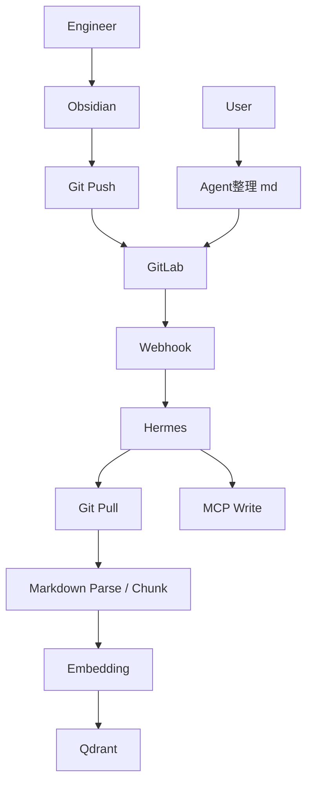

# 知識庫系統架構說明

## 1. 架構總覽
系統以 GitLab 作為唯一正式來源，Hermes 負責接收變更事件、執行同步、完成 embedding，最後寫入 Qdrant。

## 2. 元件職責

### 2.1 Obsidian
- 工程師日常編寫知識內容的工具。
- 主要產出 Markdown。
- 可包含附件，但附件不進索引。

### 2.2 GitLab
- 唯一正式來源。
- 保存版本歷史、差異與回滾能力。
- merge 到主分支後才視為正式發布。

### 2.3 Webhook
- 只在 merge 事件後觸發正式同步。
- 將事件送往 Hermes。
- 建議加上驗證機制，避免偽造請求。

### 2.4 Hermes
- 知識庫同步與索引的核心協調層。
- 接收 webhook 後啟動增量同步。
- 透過自己的 MCP 寫入能力完成寫入。
- 管理任務狀態、重試與失敗紀錄。

### 2.5 MCP
- Hermes 的寫入介面。
- 負責把整理好的索引資料寫入後端。
- 可視為 Hermes 內部已完成的能力之一。

### 2.6 Embedding
- 僅針對 Markdown 內容建立向量。
- 採 chunk 化處理。
- 變更內容需重新產生向量並更新 Qdrant。

### 2.7 Qdrant
- 儲存向量與 metadata。
- 供查詢端做相似度檢索。
- 支援增量 upsert 與刪除對應資料。

## 3. 兩種更新路徑

### 3.1 人工發布路徑
1. 工程師在 Obsidian 編寫內容。
2. Push 到 GitLab。
3. Merge 到主分支。
4. GitLab 發送 webhook。
5. Hermes 拉取最新內容。
6. Hermes 只處理變更的 Markdown。
7. Chunk、embedding、寫入 Qdrant。

### 3.2 Agent 協作路徑
1. User 下指令給 agent。
2. agent 協助整理 md。
3. 內容進入 GitLab。
4. 仍以 merge 後版本作為正式內容。
5. 後續同步流程與人工路徑相同。

## 4. 資料流原則
- GitLab 為唯一真實來源。
- Qdrant 只保存已合併版本對應的索引。
- 附件保留在 GitLab，但不進索引。
- 所有同步動作應可重跑且可追蹤。

## 5. 建議設計原則
- 事件驅動優先，不做手動批次重建。
- 增量處理優先，不做每次全量索引。
- 寫入與同步分離，避免 webhook 直接承擔重活。
- 失敗要可觀察，必要時可重試或人工介入。
