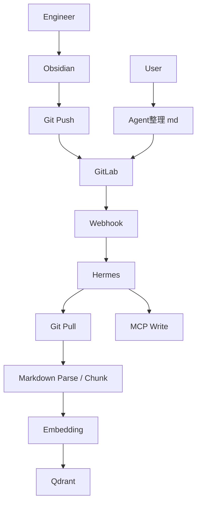

# 知識庫系統正式規格書

## 1. 文件目的
本文件定義知識庫系統的正式需求、架構、資料流、責任邊界與開發拆分，作為後續設計、實作與驗收的共同依據。

## 2. 系統目標
- 建立一套以 `GitLab` 為唯一正式來源的知識庫系統。
- 支援兩種更新知識庫方式：
  - 人工編寫後經 `GitLab merge` 正式發布。
  - 使用者下指令，由 `agent` 協助整理 `md`。
- 另支援由 `Hermes` 排程主動更新知識庫，作為 webhook 之外的補強機制。
- 正式索引與查詢內容以已合併版本為準。

## 3. 使用情境
- 工程師使用 `Obsidian` 撰寫知識內容。
- 使用者透過 `agent` 要求整理、改寫或補充既有內容。
- 內容經整理後，仍需進入 GitLab 正式版本控管流程。
- 系統在 merge 後自動更新向量索引，讓查詢端取得最新知識。

## 4. 內容範圍
- 主要格式為 `Markdown (.md)`。
- 附件可以附上，但不建立索引。
- GitLab repository 內的內容視為唯一正式版本。

## 5. 更新方式

### 5.1 方式 A：人工流程
1. 工程師在 Obsidian 編寫或修改內容。
2. Push 到 GitLab。
3. Merge 到主分支後，觸發正式同步流程。

### 5.2 方式 B：Agent 協作流程
1. User 下指令給 agent。
2. agent 協助整理、改寫、補充 `md`。
3. 產出內容後仍需進入 GitLab 正式流程。
4. 最終以 merge 後版本作為正式內容。

### 5.3 方式 C：Hermes 排程更新流程
1. Hermes 依排程主動檢查 GitLab 知識庫狀態。
2. 若偵測到待同步變更、同步失敗重試或需要重新索引的內容，則啟動更新流程。
3. Hermes 透過既有的 pull、parse、chunk、embedding、MCP write 流程完成更新。
4. 此流程可作為 webhook 漏觸、失敗重試或定期校正的補強機制。

## 6. 觸發規則
- 只在 `merge 到主分支` 後觸發正式知識庫更新。
- 不以一般 push 作為正式索引觸發點。
- 觸發來源為 `GitLab Webhook`。
- Hermes 亦可依排程主動觸發更新，但仍需遵守 GitLab 為唯一正式來源的原則。

## 7. 系統角色與責任邊界

### 7.1 Obsidian
- 工程師編寫工具。
- 主要產出 Markdown。
- 可包含附件，但附件不進索引。

### 7.2 GitLab
- 唯一正式來源。
- 保存版本歷史、差異與回滾能力。
- merge 到主分支後才視為正式發布。

### 7.3 Agent
- 協助整理 md 的內容助手。
- 可根據使用者指令產出修訂內容。
- 產出後仍需進入 GitLab 正式流程。

### 7.4 Hermes
- 知識庫同步與索引的核心協調層。
- 接收 webhook 後啟動增量同步。
- 可依排程主動發起更新與校正。
- 透過自己的 MCP 寫入能力完成寫入。
- 管理任務狀態、重試與失敗紀錄。

### 7.5 MCP
- Hermes 的寫入介面。
- 負責把整理好的索引資料寫入後端。
- 可視為 Hermes 內部已完成的能力之一。

### 7.6 Qdrant
- 儲存向量與 metadata。
- 供查詢端做相似度檢索。
- 支援增量 upsert 與刪除對應資料。

## 8. 架構總覽
系統以 GitLab 作為唯一正式來源，Hermes 負責接收變更事件、執行同步、完成 embedding，最後寫入 Qdrant。

## 9. 資料流原則
- GitLab 為唯一真實來源。
- Qdrant 只保存已合併版本對應的索引。
- 附件保留在 GitLab，但不進索引。
- 所有同步動作應可重跑且可追蹤。

## 10. 功能需求
- 系統需接收 GitLab merge webhook。
- 系統需能辨識變更檔案。
- 系統需只處理 Markdown 內容進索引。
- 系統需支援新增、修改、刪除。
- 系統需將 Markdown 內容切 chunk 後建立 embedding。
- 系統需將向量與 metadata 寫入 Qdrant。
- 系統需保留失敗重試與任務狀態紀錄。

## 11. 非功能需求
- 支援增量更新，不做每次全量重建。
- 知識更新延遲需可控，避免 merge 後長時間不可查。
- 系統需可追蹤、可回溯、可重跑。
- 附件不建立索引，但需保留在 GitLab 版本中。

## 12. 索引與儲存設計

### 12.1 Markdown 處理
- 解析 Markdown 結構。
- 去除不需要進索引的內容。
- 依段落或標題切 chunk。
- 保留必要 metadata。

### 12.2 Embedding
- 僅針對 Markdown 內容建立向量。
- 採 chunk 化處理。
- 變更內容需重新產生向量並更新 Qdrant。

### 12.3 Qdrant
- 建議至少保存以下 metadata：
  - 檔案路徑
  - 檔名
  - chunk id
  - commit hash
  - 更新時間
  - 文件標題
- 支援增量 upsert 與刪除。

## 13. Hermes 同步流程
1. 接收 GitLab webhook。
2. 驗證 webhook 來源與事件類型。
3. 建立同步任務。
4. 透過 git pull 取得最新內容。
5. 比對變更檔案。
6. 對新增、修改、刪除做不同處理。
7. 對 Markdown 執行 parse、chunk、embedding。
8. 透過 Hermes 的 MCP 寫入能力更新後端。
9. 同步結果與錯誤紀錄保存至任務狀態。

## 14. Hermes 排程更新流程
1. Hermes 依排程或定時器啟動檢查。
2. 判斷是否有待同步變更、失敗任務或需重新索引項目。
3. 若有需要，進入與 webhook 相同的同步管線。
4. 若無需要，僅記錄檢查結果並結束。

## 15. 例外處理
- Webhook 驗證失敗時，拒絕處理。
- Git pull 失敗時，保留任務狀態並等待重試。
- Markdown 解析失敗時，記錄錯誤並標記該檔案處理失敗。
- Qdrant 寫入失敗時，需可重試或由人工介入。
- 刪除或改名需同步反映到索引資料。

## 16. 驗收標準
- merge 到主分支後，Hermes 能正確收到 webhook。
- Hermes 能拉取最新內容並辨識變更檔案。
- 只有 `.md` 會進入索引流程。
- 附件可存在但不會建立向量索引。
- Qdrant 內容會隨最新合併版本更新。
- 刪除檔案後，對應索引會同步移除。
- Hermes 的 MCP 寫入流程可正常運作。
- Hermes 依排程執行時，也能完成必要的知識庫更新或重試修復。

## 17. 開發任務拆分

### 17.1 需求確認
- 確認 GitLab 為唯一正式來源。
- 確認附件可附上但不建立索引。
- 確認正式同步只在 merge 後觸發。
- 確認系統支援人工流程與 agent 協作流程。
- 確認 Hermes 排程更新的觸發條件與範圍。

### 17.2 來源與版本管理
- 建立 Obsidian 的資料夾與命名規範。
- 定義 Markdown 文件格式與模板。
- 定義附件放置方式。
- 定義 GitLab 分支策略與 merge 規則。

### 17.3 Webhook 與事件處理
- 設計 GitLab webhook 事件格式。
- 驗證 webhook 來源。
- 限定只有 merge 事件進入正式同步。
- 設計事件去重與重試機制。

### 17.4 Hermes 同步流程
- 接收 webhook 後建立同步任務。
- 透過 git pull 取得最新內容。
- 比對變更檔案。
- 對刪除、修改、新增做不同處理。
- 規劃 Hermes 排程檢查與自動補償機制。

### 17.5 Markdown 處理
- 解析 Markdown 結構。
- 去除不需要進索引的內容。
- 依段落或標題切 chunk。
- 保留必要 metadata。

### 17.6 Embedding 與索引
- 選定 embedding model。
- 建立 chunk -> embedding -> Qdrant 的流程。
- 支援增量 upsert。
- 支援刪除已失效的索引資料。

### 17.7 Qdrant 設計
- 定義 collection 命名規則。
- 定義 payload schema。
- 定義查詢所需 metadata。
- 定義版本更新與刪除策略。

### 17.8 Hermes MCP 寫入層
- 確認 MCP 寫入介面已完成並可用。
- 確認 Hermes 透過 MCP 寫入索引資料。
- 確認寫入失敗時的錯誤回報方式。

### 17.9 監控與維運
- 建立同步成功與失敗紀錄。
- 建立重試機制。
- 建立任務狀態查詢方式。
- 視需要加入告警與報表。

### 17.10 測試項目
- 測試 merge 後 webhook 是否正常觸發。
- 測試 Markdown 新增、修改、刪除是否正確同步。
- 測試附件存在時不會進入索引。
- 測試 Qdrant 是否正確 upsert 與 delete。
- 測試 Hermes MCP 寫入流程是否穩定。
- 測試 Hermes 排程是否能補抓漏掉的更新與失敗任務。

## 18. 建議開發順序
1. 先確認 GitLab webhook 與 merge 事件。
2. 完成 Hermes 拉取與變更辨識。
3. 完成 Markdown chunk 與 embedding。
4. 完成 Qdrant 寫入與刪除。
5. 補上重試、狀態與監控。
6. 最後整理 agent 協作流程與使用規範。
7. 補上 Hermes 排程更新與自動補償機制。

## 19. 待確認項目
- Agent 產生的內容是否需要先經人工審核。
- 主分支名稱是否固定為 `main`。
- Qdrant collection 命名規則。
- metadata 需要保留到什麼程度。
- 是否需要版本回溯與歷史查詢。
- Hermes 排程的執行頻率與觸發條件。
